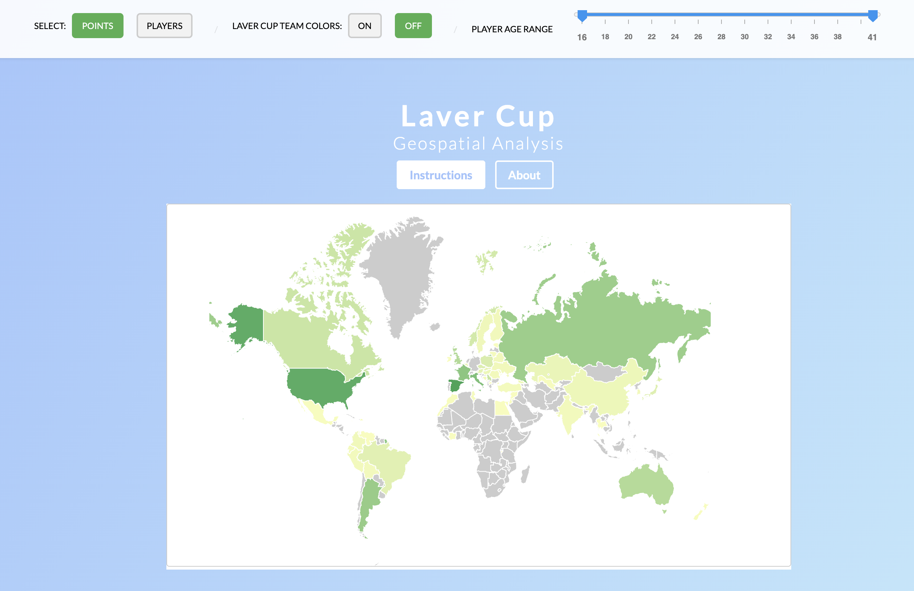
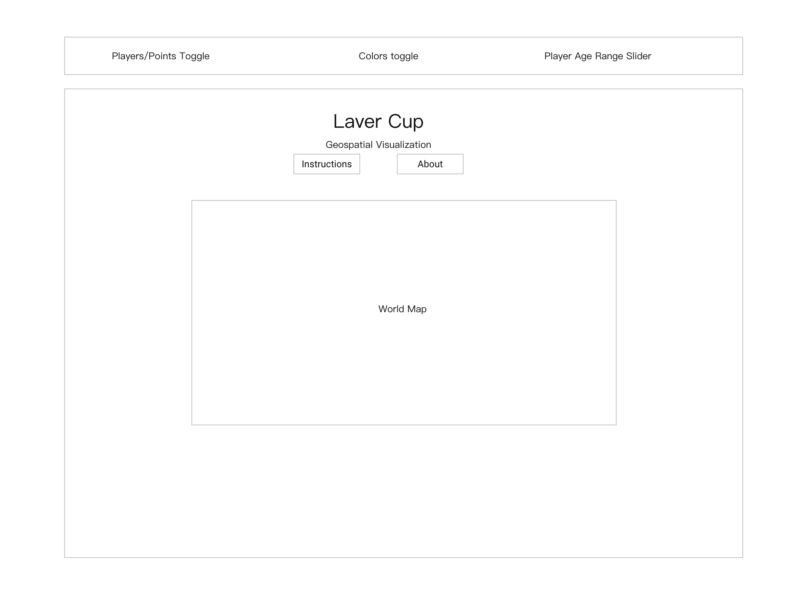

<h2 align="center">The <a href="https://lavercup.com/" target="_blank">Laver Cup</a> is an annual international men's tennis tournament where the world's top players compete in a unique team format, with Team Europe facing off against Team World.</h2>

# Laver Cup - Geospatial Visualization

Welcome to the Laver Cup - Geospatial Visualization, an interactive data visualization tool that showcases the performance and distribution of ATP players across the globe in the context of the Laver Cup.

  

## Table of Contents

1. [Introduction](#introduction)
2. [Functionality & MVPs](#functionality--mvps)
3. [Wireframe](#wireframe)
4. [Instructions for Users](#instructions-for-users)
5. [About the Project](#about-the-project)
6. [Technologies, Libraries, and APIs](#technologies-libraries-and-apis)
7. [Future Enhancements](#future-enhancements)

## Introduction

This project aims to offer valuable insights into the distribution of tennis talent in the context of the Laver Cup, enabling fans, players, and analysts to better understand the dynamics of this prestigious competition. The countries are shaded in color corresponding to the strength of the players from that country. More points (or players) means that the country is darker, and fewer points or players means the country is a lighter color. The user can also toggle on and off the colors of the Laver Cup teams, team world (red) and team europe (blue).

Explore the live project here: [https://legertom.github.io/lavercupmap/](https://legertom.github.io/lavercupmap/)

## Functionality & MVPs

The Laver Cup - Geospatial Visualization includes the following functionalities:

1. Display a world map with countries shaded based on the strength of their ATP players.
2. Toggle between visualizing the map based on points earned or the number of players from each country.
3. Show Team World (red) and Team Europe (blue) colors by toggling the Laver Cup colors on.
4. Filter the map data by player age using a slider.

## Wireframe

  

## Instructions for Users

1. **Explore the map**: Navigate the map to view the individual and collective points earned by ATP players from different countries. The color shading of each country corresponds to the strength of its players – darker shades indicate more points or players, while lighter shades represent fewer points or players.
2. **Toggle between Points and Players**: Use the toggle buttons to switch between displaying the map based on points earned or the number of players from each country.
3. **Enable Laver Cup team colors**: Activate the toggle buttons to display the countries with players on Team World (red) and Team Europe (blue) during the Laver Cup.
4. **Filter by player age**: Use the age slider to narrow down the data used for visualizing the map. For example, you can choose to display data for players aged 30 and older to see how the Laver Cup would look if only older players were allowed to participate.

## About the Project

The Laver Cup is a one-of-a-kind tennis tournament that sorts players into two teams – Team World and Team Europe – rather than categorizing them by the countries they represent, as is done in the Davis Cup and the Olympics. This map aims to offer valuable insights into the distribution of tennis talent in the context of the Laver Cup, enabling fans, players, and analysts to better understand the dynamics of this prestigious competition.

## Technologies, Libraries, and APIs

This project uses the following technologies, libraries, and APIs to deliver a seamless and interactive experience:

1. **D3.js**: The core visualization library used for creating the geospatial map and displaying the data related to ATP players and their performance. D3.js (Data-Driven Documents) is a powerful JavaScript library for manipulating documents based on data, enabling the creation of dynamic, interactive, and visually rich web applications.

2. **HTML5**: The primary markup language for structuring content on the web, providing the foundation for the layout and structure of the Laver Cup - Geospatial Visualization project.

3. **CSS3**: The latest version of Cascading Style Sheets (CSS) used for styling and formatting the visual appearance of the web application.

4. **JavaScript**: The primary scripting language used for creating interactivity and handling user input, including modal windows and toggling between data visualization modes.

5. **GitHub Pages**: A hosting platform used to serve the live version of the Laver Cup - Geospatial Visualization project, available at [https://legertom.github.io/lavercupmap/](https://legertom.github.io/lavercupmap/).

## Future Enhancements

The Laver Cup - Geospatial Visualization project aims to continuously evolve and improve, providing users with an increasingly accurate and engaging experience. Some of the planned features and enhancements include:

1. **Integration of Live Ranking Data**: To ensure the visualization always reflects the most up-to-date player rankings and statistics, we plan to integrate live ranking data from a reliable API. This will allow the map to dynamically update based on the latest available data, offering users a real-time view of the tennis world.

2. **Mobile Responsiveness**: Enhance the user experience on mobile devices by optimizing the layout and functionality of the map for touch-based navigation and smaller screens.

3. **Filter by Tournament Performance**: Allow users to filter the data based on player performance in specific tournaments, such as Grand Slams, ATP 1000, ATP 500, or ATP 250 events. This would provide insights into regional strengths across different levels of competition.

4. **Historical Data Visualization**: Enable users to view the historical performance of players and countries over time, giving them the ability to analyze trends and changes in the tennis landscape.

5. **Player Profiles**: Add the option to click on individual countries to display detailed player profiles, including player photos, biographical information, and career highlights.

6. **Improved Accessibility**: Improve the accessibility of the map by adding features such as keyboard navigation, screen reader support, and high-contrast color schemes for users with visual impairments.
